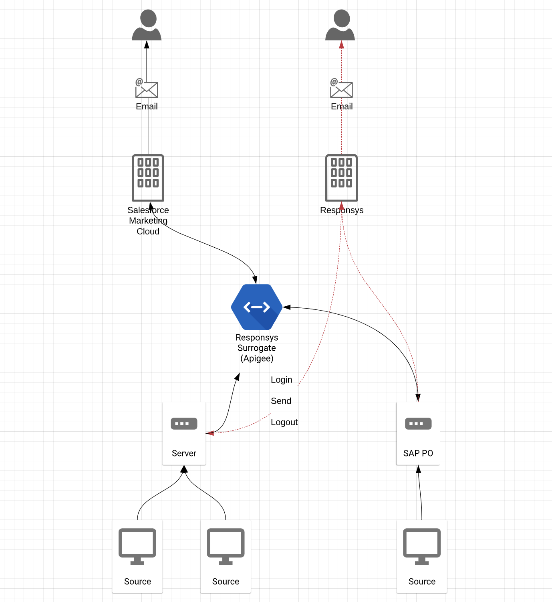

# Apigee - Salesforce Marketing Cloud Responsys Surrogate
This repository contains the code to to create a custom API middleware on Apigee which is used to act as a surrogate to move Oracle Responsys to Salesforce Marketing Cloud. Take note this does not handle all SOAP messages on Responsys.

# Intro
This is a custom Node+Express script which lives in an endpoint on Apigee. It advertises itself as a responsys service, but really works with SFMC behind the scenes to trick the original source system. You don't necesarilly need Apigee here, you could create microservices on Google Cloud or AWS of course.

# Prerequisites
1. [Google Account](https://accounts.google.com/)
2. [Apigee Edge Account](https://login.apigee.com/login) or a working API somewhere.
3. [Salesforce Marketing Cloud Account](https://login.salesforce.com/)

# LICENSE
See the [MIT LICENSE](https://github.com/nighthauk/sfmc-responsys-surrogate/blob/master/LICENSE) file.

